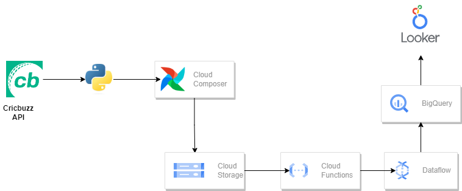
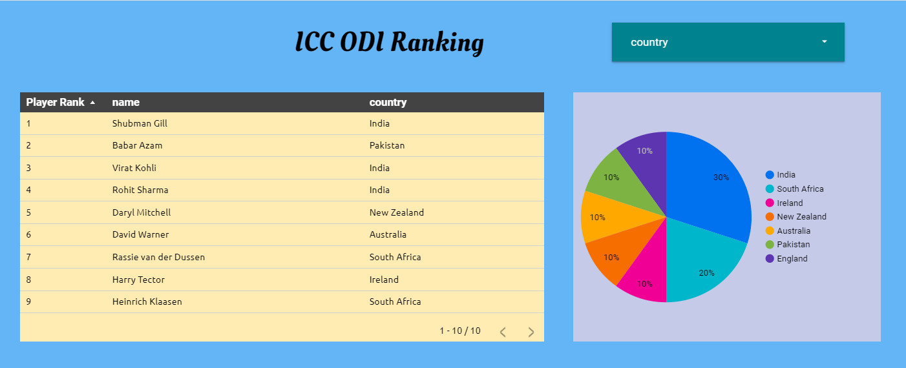

# Building a Cricket Statistics Pipeline with Google Cloud Services

A complete data engineering pipeline that fetches cricket statistics from the Cricbuzz API, processes them through Google Cloud services, and visualizes insights using Looker Studio.

## Table of Contents
- [Overview](#overview)
- [Architecture](#architecture)
- [End-to-End Flow](#end-to-end-flow)
- [Pipeline Components](#pipeline-components)
- [Project Structure](#project-structure)
- [Setup & Configuration](#setup--configuration)
- [Running the Pipeline](#running-the-pipeline)
- [Data Schema](#data-schema)
- [Dashboard](#dashboard)

## Overview

This project demonstrates a production-grade data pipeline that:
- Extracts ODI batsmen rankings from Cricbuzz API
- Processes and stores data in Google Cloud Storage (GCS)
- Transforms and loads data into BigQuery using Dataflow
- Visualizes data through Looker Studio dashboard

## Architecture



## End-to-End Flow

### 1. Data Extraction (Cricbuzz API)
**File**: `extract_and_push_gcs.py`

The pipeline starts by fetching ODI batsmen rankings from the Cricbuzz API:
- Makes HTTP request to Cricbuzz RapidAPI endpoint
- Extracts rank, batsman name, and country information
- Saves data locally as CSV

```python
# API Endpoint
https://cricbuzz-cricket.p.rapidapi.com/stats/v1/rankings/batsmen?formatType=odi

# Response fields extracted
- rank: Player ranking position
- name: Batsman name
- country: Player’s country
```

### 2. Upload to Google Cloud Storage (GCS)
**File**: `extract_and_push_gcs.py`

After data extraction, the CSV file is uploaded to GCS:
- **GCS Bucket**: `bkt-ranking-data`
- **File Format**: CSV (batsmen_rankings.csv)
- **Trigger**: Automatic upload completion notifies Cloud Function

### 3. Cloud Function Trigger
**Function**: `hello_pubsub()` in Cloud Function

When the CSV file lands in GCS:
- Event notification triggers the Cloud Function
- Function validates file upload
- Prepares parameters for Dataflow job

### 4. Dataflow Job Execution
**File**: `function.py` / `trigger_df_job.py`

The Cloud Function launches a Google Cloud Dataflow job using the **GCS_Text_to_BigQuery** template:

**Template Used**: `gs://dataflow-templates-us-central1/latest/GCS_Text_to_BigQuery`

**Job Configuration**:
```
Input File Pattern: gs://bkt-ranking-data/batsmen_rankings.csv
Output Table: prj-poc-001:cricket_dataset.icc_odi_batsman_ranking
Transform Function: transform() [UDF]
Schema Path: gs://bkt-dataflow-metadata/bq.json
```

### 5. Data Transformation (JavaScript UDF)
**File**: `udf.js`

Dataflow applies JavaScript transformation to convert CSV to JSON format:
```javascript
function transform(line) {
    var values = line.split(‘,’);
    var obj = new Object();
    obj.rank = values[0];
    obj.name = values[1];
    obj.country = values[2];
    return JSON.stringify(obj);
}
```

**Transformation Details**:
- Parses CSV row (comma-separated values)
- Maps columns to object properties
- Converts to JSON for BigQuery ingestion

### 6. BigQuery Data Loading
**File**: `bq.json`

Data is loaded into BigQuery with the defined schema:

**Dataset**: `cricket_dataset`  
**Table**: `icc_odi_batsman_ranking`

**Schema**:
| Column | Type | Description |
|--------|------|-------------|
| rank | STRING | Player’s ODI ranking position |
| name | STRING | Batsman’s full name |
| country | STRING | Country code/name |

### 7. Looker Studio Dashboard
**Visualization**: `Looker.png`

BigQuery serves as the data source for Looker Studio:
- Real-time dashboard reflecting latest rankings
- Interactive visualizations and filters
- Automated refreshes as new data arrives

## Pipeline Components

### Core Python Scripts

| File | Purpose | Trigger |
|------|---------|---------|
| `extract_and_push_gcs.py` | Extract from API & upload to GCS | Manual or Airflow DAG |
| `extract_data.py` | Local data extraction (reference) | Manual testing |
| `function.py` | Cloud Function handler | GCS file upload event |
| `trigger_df_job.py` | Dataflow job launcher | Called by Cloud Function |
| `dag.py` | Apache Airflow DAG (scheduling) | Daily schedule @daily |

### Supporting Files

| File | Purpose |
|------|---------|
| `bq.json` | BigQuery table schema definition |
| `udf.js` | JavaScript transformation for data |
| `requirements.txt` | Python dependencies |
| `batsmen_rankings.csv` | Sample output data |

## Project Structure

```
cricket-stat-data-engineering-project/
├── extract_data.py                 # API extraction (local)
├── extract_and_push_gcs.py        # API extraction + GCS upload
├── function.py                     # Cloud Function code
├── trigger_df_job.py              # Dataflow trigger
├── dag.py                         # Airflow DAG (scheduling)
├── bq.json                        # BigQuery schema
├── udf.js                         # Data transformation function
├── requirements.txt               # Python dependencies
├── batsmen_rankings.csv          # Sample data output
├── Architecture.png              # Pipeline architecture diagram
├── Looker.png                    # Dashboard screenshot
└── README.md                     # This file
```

## Setup & Configuration

### Prerequisites
- Google Cloud Project with Billing enabled
- Credentials for: Cloud Storage, Dataflow, BigQuery, Cloud Functions
- RapidAPI key for Cricbuzz API
- Python 3.7+ with required packages

### Installation

1. **Clone the repository**
   ```bash
   git clone https://github.com/jiyaan-data-engineering/batch-09.git
   cd batch-09
   ```

2. **Install dependencies**
   ```bash
   pip install -r requirements.txt
   ```

3. **Configure credentials**
   ```bash
   export GOOGLE_APPLICATION_CREDENTIALS="/path/to/service-account-key.json"
   ```

4. **Update API key**
   - Replace `"Replace with your RapidAPI key"` in:
     - `extract_data.py` (line 6)
     - `extract_and_push_gcs.py` (line 7)

5. **Update GCP project details**
   - Update project ID: `prj-poc-001` → your project ID
   - Create/update bucket names as needed
   - Create dataset `cricket_dataset` in BigQuery

### Google Cloud Setup

1. **Create GCS Buckets**
   ```bash
   gsutil mb gs://bkt-ranking-data/
   gsutil mb gs://bkt-dataflow-metadata/
   ```

2. **Upload metadata files**
   ```bash
   gsutil cp bq.json gs://bkt-dataflow-metadata/
   gsutil cp udf.js gs://bkt-dataflow-metadata/
   ```

3. **Create BigQuery Dataset**
   ```bash
   bq mk --dataset cricket_dataset
   ```

4. **Deploy Cloud Function**
   - Function entry point: `hello_pubsub`
   - Trigger: Cloud Storage (Finalize/Create event on `bkt-ranking-data`)
   - Runtime: Python 3.9+

## Running the Pipeline

### Option 1: Manual Execution
```bash
python extract_and_push_gcs.py
```
- Extracts data from API
- Uploads to GCS
- Cloud Function automatically triggers Dataflow

### Option 2: Scheduled with Airflow
```bash
# Copy dag.py to Airflow DAGs folder
cp dag.py ~/airflow/dags/

# Trigger DAG
airflow dags trigger fetch_cricket_stats
```
- Runs daily at midnight
- Automatically extracts and processes data

### Option 3: Manual Dataflow Trigger
```bash
python trigger_df_job.py
```
- Directly launches Dataflow job
- Use when GCS already contains data

## Data Schema

**Source Data Fields**:
```
rank, name, country
1, Virat Kohli, India
2, Steve Smith, Australia
...
```

**BigQuery Table** (icc_odi_batsman_ranking):
```sql
CREATE TABLE cricket_dataset.icc_odi_batsman_ranking (
  rank STRING,
  name STRING,
  country STRING
);
```

## Dashboard



The Looker Studio dashboard displays:
- Live ODI batsmen rankings
- Country-wise distribution of top performers
- Ranking trends and changes
- Interactive filters by country and rank range

**Data Refresh**: Auto-refreshes based on BigQuery data updates

## Key Features

✅ **Automated Data Pipeline** - Minimal manual intervention  
✅ **Scalable Architecture** - Handles large datasets with Dataflow  
✅ **Data Transformation** - JavaScript UDF for flexible transformations  
✅ **Real-time Visualization** - Live Looker dashboards  
✅ **Scheduled Execution** - Airflow DAG for daily runs  
✅ **Cloud-Native** - Fully leverages Google Cloud Platform  

## Dependencies

- **google-cloud-storage** - GCS operations
- **google-api-python-client** - Dataflow API calls
- **requests** - API calls to Cricbuzz
- **apache-airflow** - Workflow orchestration (optional)

See `requirements.txt` for full list.

## Troubleshooting

| Issue | Solution |
|-------|----------|
| API key not valid | Update RapidAPI key in Python files |
| GCS access denied | Check service account permissions |
| Dataflow job fails | Verify schema in bq.json matches transformation |
| BigQuery load errors | Check UDF output format matches schema |

## Future Enhancements

- [ ] Add data quality checks
- [ ] Implement error handling and retries
- [ ] Add data lineage tracking
- [ ] Extend to other cricket formats (T20, Test)
- [ ] Add alert notifications on anomalies
- [ ] Implement incremental data loading

## References

- [Cricbuzz API Documentation](https://rapidapi.com/cricketapi/api/cricbuzz-cricket)
- [Google Dataflow Documentation](https://cloud.google.com/dataflow/docs)
- [BigQuery Data Loading](https://cloud.google.com/bigquery/docs/loading-data)
- [Looker Studio](https://lookerstudio.google.com/)
- [Apache Airflow](https://airflow.apache.org/)
