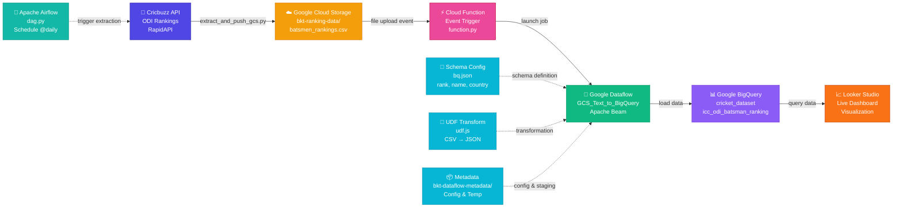

# Architecture Diagram

## Architecture Overview

### Data Flow Pipeline

1. **Data Extraction** → Cricbuzz API extracts ODI batsmen rankings
2. **Cloud Storage** → CSV uploaded to Google Cloud Storage
3. **Event Trigger** → Cloud Function detects file upload
4. **Processing** → Google Dataflow processes data using template
5. **Transformation** → JavaScript UDF converts CSV to JSON format
6. **Data Loading** → Transformed data loads into BigQuery
7. **Visualization** → Looker Studio queries BigQuery for dashboards

### Supporting Components

- **Schema Definition (bq.json)** → Defines BigQuery table structure
- **UDF Transformation (udf.js)** → Converts CSV rows to JSON objects
- **Metadata Storage** → Holds configuration and temporary files
- **Airflow DAG (dag.py)** → Schedules daily data extraction

### Technology Stack

| Component | Service | Purpose |
|-----------|---------|---------|
| Data Source | Cricbuzz API (RapidAPI) | Fetch cricket statistics |
| Storage | Google Cloud Storage | Store raw CSV data |
| Orchestration | Cloud Functions / Airflow | Trigger processing pipeline |
| Processing | Google Dataflow | Transform and load data |
| Data Warehouse | Google BigQuery | Store processed data |
| Visualization | Looker Studio | Create interactive dashboards |

